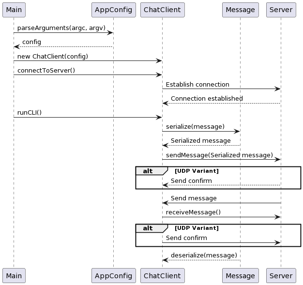

# **IPK 2024 Chat Client Documentation**

## **Table of Contents**
- [Project structure](#project-structure)
- [Executive Summary](#executive-summary)
- [System Overview](#system-overview)
- [Testing](#testing)
- [Bibliography](#bibliography)

## **Project Structure**
```
├── src/                        # Source files directory
│   ├── main.cpp                # Main source file
│   ├── ChatClient.cpp          # Contains client class 
│   │                             and main methods
│   ├── CommandLineParser.cpp   # Methods for start
│   │                             arguments parsing
│   └── ValidationHelpers.cpp   # Validation methods
│  
├── include/                    # Header files directory
│   ├── AppConfig.h             # Config structure
│   ├── ChatClient.h
│   ├── CommandLineParser.h
│   ├── Messages.h              # Contains structures
│   │                             with methods for
│   │                             different types of
│   │                             messages
│   └── ValidationHelpers.h
│
├── obj/
│   └── *.o
│  
├── doc/                        # Resources for README
│  
├── Makefile
├── README.md
├── CHANGELOG.md
└── LICENSE                     # GNU license
```

## **Executive Summary**
The chat client application is designed to communicate using a proprietary protocol over the network with a chat server.

### Networking Fundamentals

The application leverages standard networking protocols, including TCP (Transmission Control Protocol) [RFC9293] and UDP (User Datagram Protocol) [RFC768], to establish connections and transmit data over the Internet. Understanding the differences between these transport layer protocols is crucial:

- **TCP** provides a reliable, ordered, and error-checked delivery of a stream of octets between applications running on hosts communicating via an IP network. Key features include connection-oriented communication, flow control, congestion control, and error recovery.
  
- **UDP** is a simpler, connection-less Internet protocol. It provides a way for applications to send encapsulated IP datagrams without establishing a connection. Unlike TCP, UDP does not guarantee message delivery, order, or error checking, making it faster and more efficient for applications that do not require reliable data transfer.

### Protocol Design

The `IPK24-CHAT` protocol specifies the format and the procedure for exchanging messages for a chat application. It includes definitions for message types such as authentication (`AUTH`), join (`JOIN`), message (`MSG`), error (`ERR`), bye (`BYE`) and confirm (`CONFIRM`) for UDP. The protocol operates on top of TCP or UDP, requiring different approaches to handle the characteristics of these transport protocols.

## **System Overview**
First of all, we create configuration based on parsed command line arguments. 

**Options for client configuration:**

```
ipk24chat-client -s <server_ip_or_hostname> -p <port> -t <tcp_or_udp> [-d <udp_confirmation_timeout>] [-r <udp_retransmissions>]

    -t tcp|udp  Transport protocol used for connection
                (required).

    -s <host>   Server IP address or hostname
                (required).

    -p <port>   Server port, default is 4567 (optional).

    -d <timeout>    UDP confirmation timeout in milliseconds, default is 250 (optional).

    -r <retransmissions>    Maximum number of UDP
                            retransmissions, default is
                            3 (optional).

    -h  Prints this help output and exits.
```

Then system establishes connection with server using provided configuration and starts `poll()`ing `stdin` and input from opened socket.


*Here is an abstract UML diagram that shows how client works*

### Dynamic Port Handling for UDP
One of the core functionalities includes handling dynamic port allocation for UDP communication. This mechanism allows the server to communicate with clients through different ports after the initial message exchange. On the client side it requires to catch new port after message received in UDP variant.

### Message Serialization and Deserialization
`Message.h` contains two main functions for almost every message type structure: `serialize()` and `deserialize()`.

The `serialize()` is overloaded to cater to both TCP and UDP message formats. For TCP, it constructs a protocol-specific string message, whereas for UDP, it constructs a byte vector including the message type and data, adhering to the protocol's requirement for a binary format. `deserialize()` works the same way, but returns filled up structure of specific message type.

### UDP timeouts
For UDP timeouts i had to create special message structure that contains message data for retransmissions and variable that contains exact time when message was sent. There is method `checkForTimeouts()` in `ChatClient.cpp` that checks if confirm is received and if received in time.

## **Testing**
For testing I used provided virtual image, provided `c` developer environment and provided Discord server.

- **Test**: Insure that we correctly waiting for `/auth` first and then for `REPLY` message.

    **Input**:
    ```
    ./ipk24chat-client -t tcp -s anton5.fit.vutbr.cz

    aboba

    /auth xtiemn00 8d455368-f18e-4929-8627-588ff55d0114 amogus

    ^C
    ```

    **Output**:
    ```
    # After message "aboba" before /auth
    ERR: you must authenticate first
    Available commands:
    /auth <Username> <Secret> <DisplayName> - Authenticate with the server.
    /join <ChannelID> - Join a chat channel.
    /rename <DisplayName> - Change your display name.
    /help - Show help message.

    # After /auth with correct arguments
    Success: Authentication successful.
    Server: amogus joined discord.general.
    Server: testerino joined discord.general.
    Server: Adam joined discord.general.

    # C-c pressed
    ERR: Ctrl+C pressed. Shutting down...
    ERR: pollInterrupted system call
    ```

- **Test**: Incorrect start config for chat client:

    **Input**:
    ```
    ./ipk24chat-client -t tcp -v
    ```

    **Output**:
    ```
    ./ipk24chat-client: invalid option -- 'v'
    ERR: Failed to parse arguments!
    usage: ipk24chat-client -s <server_ip_or_hostname> -p <port> -t <tcp_or_udp> [-d <udp_confirmation_timeout>] [-r <udp_retransmissions>]
    -t tcp|udp	Transport protocol used for connection (required).
    -s <host>	Server IP address or hostname (required).
    -p <port>	Server port, default is 4567 (optional).
    -d <timeout>	UDP confirmation timeout in milliseconds, default is 250 (optional).
    -r <retransmissions>	Maximum number of UDP retransmissions, default is 3 (optional).
    -h		Prints this help output and exits.
    ```

- **Test**: Incorrect server name and/or port:

    **Input**:
    ```
    ./ipk24chat-client -t tcp -s anton5.fit.vutbr.cz -p 1111
    
    ./ipk24chat-client -t tcp -s anton5.fit.vutbr.c
    ```

    **Output**:
    ```
    # ./ipk24chat-client -t tcp -s anton5.fit.vutbr.cz -p 1111
    ERR: client: connect
    ERR: client: failed to connect
    ERR: Could not connect to the server.

    # ./ipk24chat-client -t tcp -s anton5.fit.vutbr.c
    ERR: getaddrinfo: Name or service not known
    ERR: Could not connect to the server.
    ```

## **Bibliography**
- Beej's Guide to Network Programming. Link: [https://beej.us/guide/bgnet/html/](https://beej.us/guide/bgnet/html/)
- GitHub. Learn about I/O polling in Linux. Link: [https://github.com/pniewiejski/learn-io-polling](https://github.com/pniewiejski/learn-io-polling)
- Stackoverflow. Client in C++, use gethostbyname or getaddrinfo. Remy Lebeau. Link: [https://stackoverflow.com/questions/52727565/](https://stackoverflow.com/questions/52727565/client-in-c-use-gethostbyname-or-getaddrinfo)
- GitHub. C++: how to poll the TCP socket to read and write data. Link: [https://gist.github.com/elvinio/387b92a775f7ff426124](https://gist.github.com/elvinio/387b92a775f7ff426124)
- Root.cz. Sokety a C/C++: funkce poll a závěr. Link: [https://www.root.cz/clanky/sokety-a-c-funkce-poll-a-zaver/](https://www.root.cz/clanky/sokety-a-c-funkce-poll-a-zaver/)
- Superuser. How do I interactively type \r\n-terminated query in netcat? meuh. Link: [https://superuser.com/questions/942217/how-do-i-interactively-type-r-n-terminated-query-in-netcat](https://superuser.com/questions/942217/how-do-i-interactively-type-r-n-terminated-query-in-netcat)
- FIT VPN. Link: [https://www.fit.vut.cz/units/cvt/net/vpn.php.en](https://www.fit.vut.cz/units/cvt/net/vpn.php.en)
- opengroup.org. Link [https://pubs.opengroup.org](https://pubs.opengroup.org)